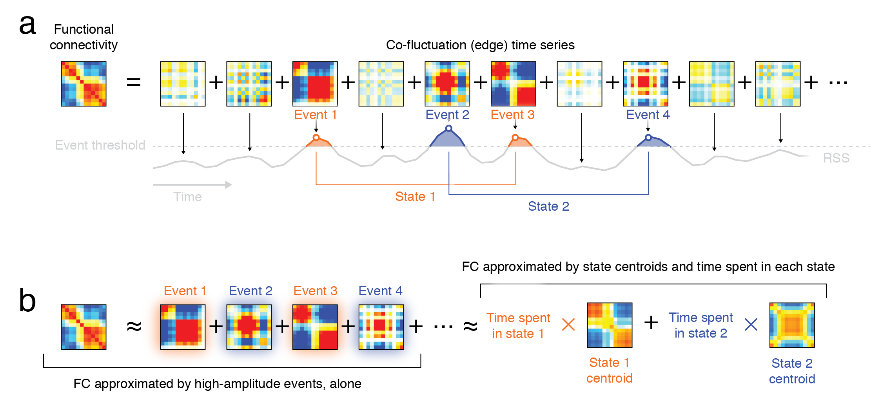

# event_detection
Perform event detection, clustering, and FC prediction as in Betzel et al (2021):  Individualized event structure drives individual differences in whole-brain functional connectivity. 

# dependencies and requirements
This script uses MATLAB. It was tested using MATLAB 2020a on macOS Mojave 10.14.6. It requires no additional software packages.

# installation and usage
Download and unzip the directory, open MATLAB, and then navigate to wherever you downloaded the files. You can run the script from within that directory. The example script uses the Generalized Louvain function for performing community detection. It can be downloaded [here](http://netwiki.amath.unc.edu/GenLouvain/GenLouvain).

# what is here
* Example parcellated resting fMRI BOLD time series from [here](https://www.dropbox.com/sh/tb694nmpu2lbpnc/AABKU_Mew7hyjtAC4ObzGVaKa?dl=0).
* System labels for each brain region.
* Analysis script.

# what does the script do?
1. Reads in the parcel time series data, generates edge time series, and calculates the root sum squared (RSS) amplitude at each frame. 
2. Uses a circular-shift null model to generate null time series and repeats the procedure from Step 1, resulting in a null distribution of RSS values.
3. Identifies statistically significant frames (observed RSS > than that of null) and partitions time series into segments of temporally contiguous supra-threshold frames.
4. Identifies peak RSS within each segment and extracts pattern of activity (parcel time series) and edge time series (co-fluctuation) at that instant.
5. Clusters those co-fluctuation patterns using modularity maximization and estimates cluster (community) centroids.
6. Generated a predicted FC matrix given the detected communities and the frequencies with which different clusters appear.
7. Makes a couple figures.

# if you want to apply this method to your data
* Simply replace the "ts.mat" variable with a [time x node] matrix of neural recordings.

Runtime for entire script depends on size of neural recordings variable, but for the data included here, it takes  approximately 100 s.

If you use this code, please cite:
R Betzel, S Cutts, S Greenwell, O Sporns (2021). Individualized event structure drives individual differences in whole-brain functional connectivity. bioRxiv [link to paper](https://www.biorxiv.org/content/10.1101/2021.03.12.435168v1.abstract)

For the Generalized Louvain algorithm, please also cite:
Jutla, I. S., Jeub, L. G., & Mucha, P. J. (2011). A generalized Louvain method for community detection implemented in MATLAB. URL http://netwiki. amath. unc. edu/GenLouvain.
